<picture>
  <source media="(prefers-color-scheme: dark)" srcset="./assets/card-dark.svg">
  <source media="(prefers-color-scheme: light)" srcset="./assets/card-light.svg">
  
</picture>

↑↓ all cards refresh via a <a href="./.github/workflows/update.yml">GitHub Action</a>

<picture>
  <source media="(prefers-color-scheme: dark)" srcset="./assets/chain-dark.svg">
  <source media="(prefers-color-scheme: light)" srcset="./assets/chain-light.svg">
  
</picture>

[`[ site ]`](https://dimitrisofikitis.com) &nbsp; [`[ linkedin ]`](https://gr.linkedin.com/in/dimitrisofikitis) &nbsp; [`[ email ]`](mailto:d.sofikitis@icloud.com) &nbsp; [`[ resume ]`](https://dimitrisofikitis.com/resume) &nbsp; [`[ apps ]`](https://apps.dimitrisofikitis.com) &nbsp; [`[ yep, that's me 🍎 ]`](https://www.urbandictionary.com/define.php?term=Apple+Fanboy)

<picture>
  <source media="(prefers-color-scheme: dark)" srcset="./assets/activity-dark.svg">
  <source media="(prefers-color-scheme: light)" srcset="./assets/activity-light.svg">
  
</picture>

 

`> cat /etc/footer` — hand-crafted SVGs · stdlib Python · regenerated daily by GitHub Actions · designed to age well
