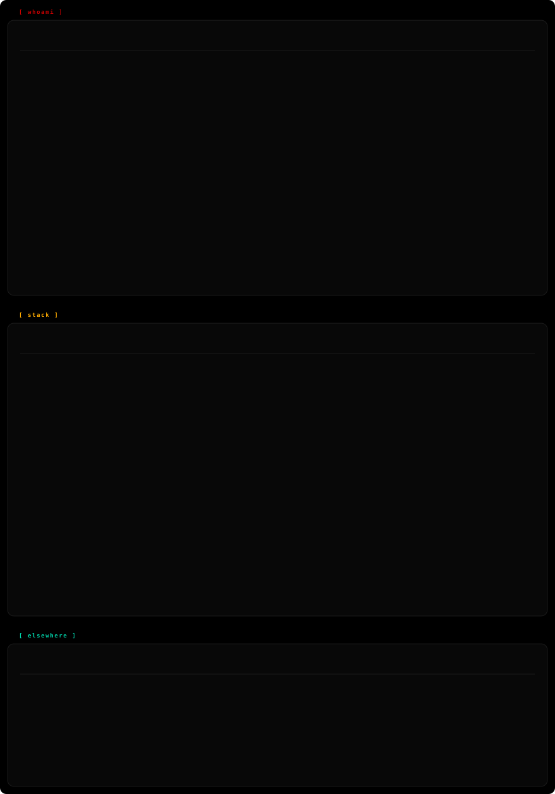
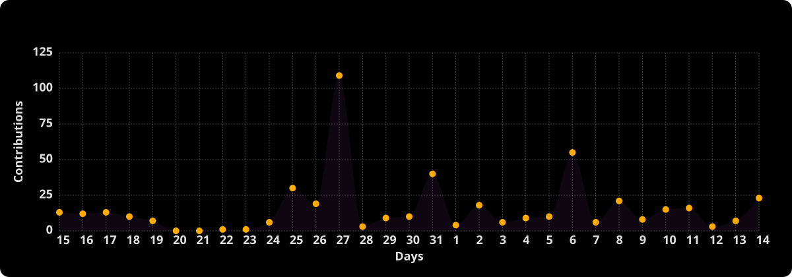

<picture>
  <source media="(prefers-color-scheme: dark)" srcset="./assets/card-dark.svg">
  <source media="(prefers-color-scheme: light)" srcset="./assets/card-light.svg">
  
</picture>

<picture>
  <source media="(prefers-color-scheme: dark)" srcset="./assets/chain-dark.svg">
  <source media="(prefers-color-scheme: light)" srcset="./assets/chain-light.svg">
  
</picture>

<a href="https://dimitrisofikitis.com">`site`</a> &nbsp; <a href="https://gr.linkedin.com/in/dimitrisofikitis">`linkedin`</a> &nbsp; <a href="mailto:d.sofikitis@icloud.com">`email`</a> &nbsp; <a href="https://dimitrisofikitis.com/resume">`resume`</a> &nbsp; <a href="https://apps.dimitrisofikitis.com">`apps`</a>

<picture>
  <source media="(prefers-color-scheme: dark)" srcset="./assets/activity-dark.svg">
  <source media="(prefers-color-scheme: light)" srcset="./assets/activity-light.svg">
  
</picture>

 

`> cat /etc/footer` % regenerated daily by <a href="./.github/workflows/update.yml">an Action</a>

